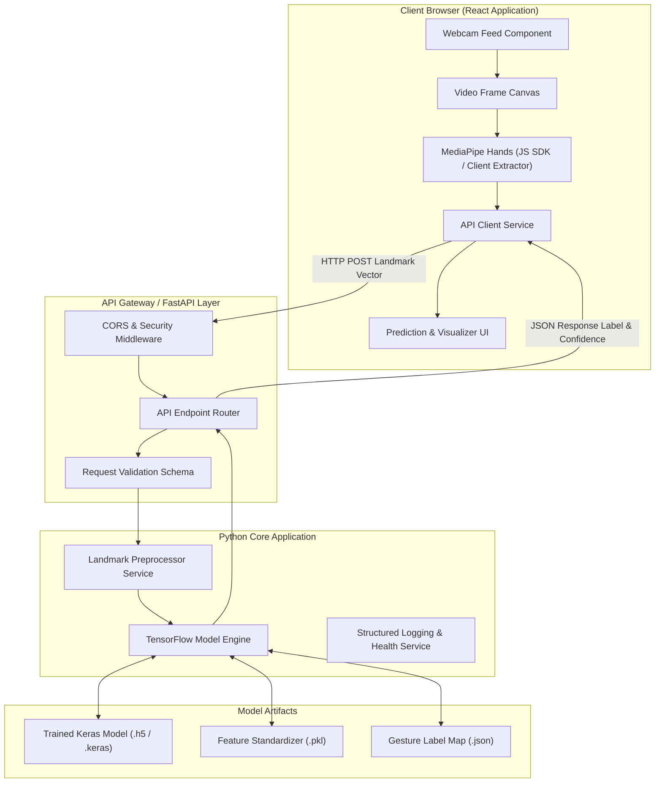
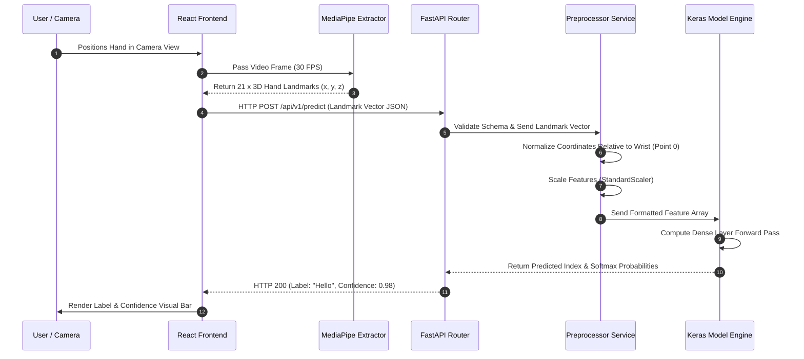
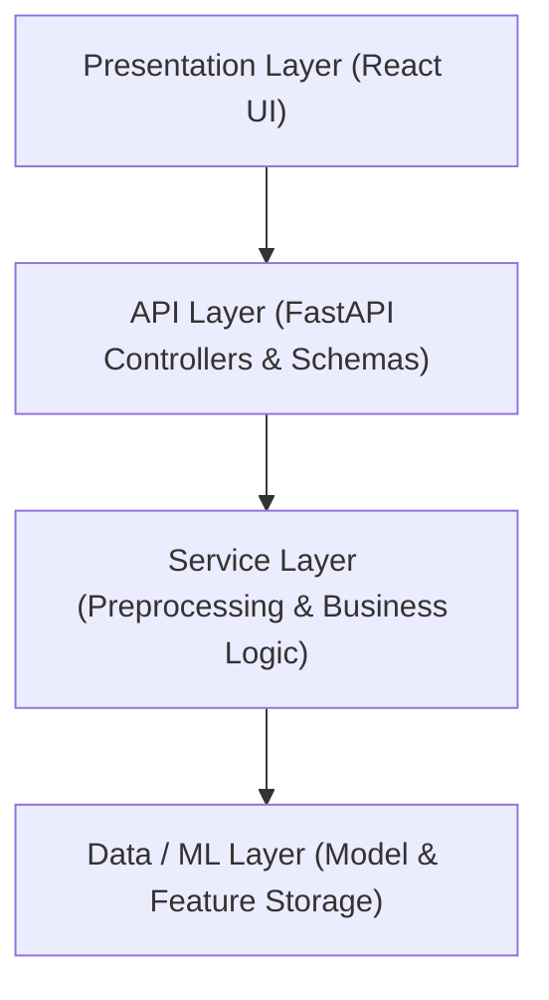
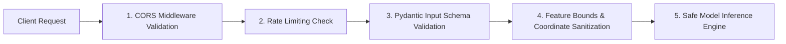

# Technical Architecture Blueprint

## System Overview

**Speak-without-voice** employs a decoupled client-server architecture. The frontend application runs in the user's browser, handling video frame ingestion, UI rendering, and user interactions. The backend system, built using Python and FastAPI, processes MediaPipe 3D hand landmarks and executes gesture classification through a trained TensorFlow/Keras neural network.

---

## High-Level Architecture Diagram



---

## Complete Folder & File Structure Blueprint

```
Speak-without-voice/
│
├── backend/
│   ├── app/
│   │   ├── api/
│   │   │   ├── v1/
│   │   │   │   ├── endpoints/
│   │   │   │   │   ├── predict.py
│   │   │   │   │   └── health.py
│   │   │   │   └── router.py
│   │   │   └── dependencies.py
│   │   │
│   │   ├── core/
│   │   │   ├── config.py
│   │   │   ├── logging.py
│   │   │   └── security.py
│   │   │
│   │   ├── services/
│   │   │   ├── landmark_preprocessor.py
│   │   │   └── gesture_classifier.py
│   │   │
│   │   ├── schemas/
│   │   │   ├── landmark_schema.py
│   │   │   ├── prediction_schema.py
│   │   │   └── health_schema.py
│   │   │
│   │   └── main.py
│   │
│   └── requirements.txt
│
├── frontend/
│   ├── public/
│   │   ├── favicon.ico
│   │   └── index.html
│   │
│   ├── src/
│   │   ├── assets/
│   │   │   └── styles/
│   │   │       ├── variables.css
│   │   │       └── global.css
│   │   │
│   │   ├── components/
│   │   │   ├── WebcamFeed/
│   │   │   │   ├── WebcamFeed.jsx
│   │   │   │   └── WebcamFeed.module.css
│   │   │   ├── PredictionDisplay/
│   │   │   │   ├── PredictionDisplay.jsx
│   │   │   │   └── PredictionDisplay.module.css
│   │   │   ├── GestureGuide/
│   │   │   │   ├── GestureGuide.jsx
│   │   │   │   └── GestureGuide.module.css
│   │   │   └── Header/
│   │   │       ├── Header.jsx
│   │   │       └── Header.module.css
│   │   │
│   │   ├── services/
│   │   │   ├── api.js
│   │   │   └── mediapipe.js
│   │   │
│   │   ├── hooks/
│   │   │   ├── useWebcam.js
│   │   │   └── usePrediction.js
│   │   │
│   │   ├── utils/
│   │   │   └── constants.js
│   │   │
│   │   ├── App.jsx
│   │   └── main.jsx
│   │
│   └── package.json
│
├── docs/
│   ├── PRD.md
│   ├── Architecture.md
│   ├── Rules.md
│   ├── Phases.md
│   ├── Design.md
│   └── Memory.md
│
├── data/
│   ├── raw/
│   │   └── .gitkeep
│   ├── processed/
│   │   └── .gitkeep
│   └── dataset_collector.py
│
├── models/
│   ├── gesture_classifier.keras
│   ├── feature_scaler.pkl
│   ├── label_map.json
│   └── model_metadata.json
│
├── tests/
│   ├── backend/
│   │   ├── unit/
│   │   └── integration/
│   └── frontend/
│
├── scripts/
│   ├── train_model.py
│   ├── evaluate_model.py
│   └── export_model.py
│
├── README.md
├── LICENSE
├── .gitignore
├── .env.example
├── requirements.txt
└── package.json
```

---

## Application & Data Flows

### 1. Data Capture & Preprocessing Flow



---

## Component Responsibilities

### Frontend Layer (React)
* **Webcam Capture Component**: Manages camera permissions, stream setup, and frame rate throttling.
* **Landmark Extractor Service**: Executes MediaPipe Hands in the client environment to identify 21 3D hand keypoints per frame.
* **API Service Layer**: Encapsulates HTTP communication with backend API endpoints, featuring retry logic and timeout handling.
* **UI Components**: Renders live video feedback, gesture labels, confidence meters, and system health status.

### Backend Layer (FastAPI)
* **API Gateway & Router**: Defines versioned endpoints (`/api/v1/predict`, `/api/v1/health`), handles CORS middleware, and parses request payloads.
* **Schema Validator**: Enforces strict Pydantic data schemas on incoming landmark coordinates.
* **Preprocessor Service**: Converts raw $21 \times 3$ coordinate inputs into normalized, zero-centered, and feature-scaled vector formats matching model training parameters.
* **Inference Engine**: Thread-safe wrapper around TensorFlow/Keras model loading, executing matrix predictions with low latency.
* **Core Config & Logging**: Manages environment variables, log formatting, and health monitoring.

---

## Educational Breakdown of Software Patterns

This section explains foundational software engineering concepts, contrasting their application across startups, enterprise environments, and Big Tech (Google/Amazon/Microsoft).

---

### 1. Separation of Concerns (SoC)

#### Explanation
Separation of Concerns is the design principle of dividing a computer program into distinct sections, such that each section addresses a separate concern or responsibility. Code that handles UI rendering should not perform data preprocessing or ML inference.

#### Industry Implementation Comparison
* **Startup**: Often keeps code simple by splitting into basic `frontend` and `backend` folders, maintaining direct function calls across boundaries.
* **Enterprise**: Enforces strict architectural barriers using micro-services or modular monoliths with strict repository boundaries and independent deployments.
* **Big Tech**: Implements SoC via micro-services communicating through gRPC or protocol buffers, backed by dedicated infrastructure teams for each concern.
* **Project Assessment**: Critical for this project. We strictly isolate landmark extraction, API handling, preprocessing, and model execution.

---

### 2. Layered Architecture (N-Tier)

#### Explanation
Layered Architecture organizes code into horizontal layers, where each layer has a specific role (e.g., Presentation Layer $\rightarrow$ API Layer $\rightarrow$ Service Layer $\rightarrow$ Data/ML Layer). Lower layers must not depend on higher layers.



#### Industry Implementation Comparison
* **Startup**: Combines API controllers and service logic inside single route handlers to ship features quickly.
* **Enterprise**: Enforces strict tier boundaries where HTTP request handlers only pass data to decoupled service classes.
* **Big Tech**: Implements clean architecture across isolated services, enforcing interface contracts between every tier.
* **Project Assessment**: Recommended for our backend (`api` $\rightarrow$ `services` $\rightarrow$ `schemas`).

---

### 3. Dependency Injection (DI)

#### Explanation
Dependency Injection is a software design pattern in which an object or function receives its dependencies from an external source rather than creating them internally. This makes components easily testable by allowing dependencies (such as ML model engines or logger instances) to be replaced with mock implementations during automated testing.

#### Industry Implementation Comparison
* **Startup**: Uses global singleton objects initialized directly inside service modules.
* **Enterprise**: Uses formal IoC (Inversion of Control) containers (e.g., Spring for Java, Dependency Injector for Python).
* **Big Tech**: Relies heavily on compile-time or runtime DI frameworks (e.g., Google Dagger/Guice) across huge codebases.
* **Project Assessment**: We utilize FastAPI's native `Depends()` mechanism for clean service injection without heavy external IoC frameworks.

---

### 4. Repository Pattern

#### Explanation
The Repository Pattern mediates between the domain/service layer and data mapping layers using a collection-like interface for accessing domain objects. It isolates business logic from data storage mechanisms.

#### Industry Implementation Comparison
* **Startup**: Connects directly to databases or files via ORM calls embedded in API endpoints.
* **Enterprise**: Wraps all database access in explicit Repository classes with abstract interfaces.
* **Big Tech**: Implements distributed repository abstraction layers backing scalable datastores (Spanner, DynamoDB).
* **Project Assessment**: **Overkill for MVP**. Since our MVP reads a static Keras model file from disk rather than querying a database, a full Repository pattern is postponed to future phases when user data or dynamic model registries are added.

---

### 5. Middleware

#### Explanation
Middleware is software that provides common services and capabilities to applications outside of what's offered by the operating system. In web backend development, middleware intercepts HTTP requests before they reach endpoints and intercepts responses before they return to clients (e.g., handling CORS headers, request logging, or timing).

#### Industry Implementation Comparison
* **Startup**: Basic CORS middleware setup using framework defaults.
* **Enterprise**: Complex middleware pipelines handling token validation, rate limiting, header manipulation, and auditing.
* **Big Tech**: Specialized API Gateways (e.g., Envoy, Kong) managing middleware logic at the infrastructure edge before requests hit services.
* **Project Assessment**: Essential for MVP. We implement CORS middleware and HTTP request latency logging middleware.

---

### 6. MVC (Model-View-Controller) & Service Layer Pattern

#### Explanation
MVC separates application logic into three interconnected components: Model (data structure), View (user interface), and Controller (request router). A Service Layer sits between the Controller and Model, housing core business algorithms and data transformations.

#### Industry Implementation Comparison
* **Startup**: Direct Controller-to-Model coupling inside routes.
* **Enterprise**: Strict separation: Views handle UI, Controllers validate HTTP payloads, Services execute business rules, Models represent data state.
* **Big Tech**: Micro-frontend views interacting with decoupled backend micro-service domains.
* **Project Assessment**: We implement a modern decoupled variant: React represents the View, FastAPI endpoints act as Controllers, and python modules (`services/`) house the Service Layer.

---

### 7. Configuration Management

#### Explanation
Configuration Management ensures application behavior can be modified across environments (Development, Staging, Production) without changing source code. Settings (API keys, ports, model file paths) are loaded from environment variables (`.env`).

#### Industry Implementation Comparison
* **Startup**: Flat `.env` files read using `dotenv` packages.
* **Enterprise**: Centralized secret management services (HashiCorp Vault, AWS Secrets Manager) with environment validation.
* **Big Tech**: Dynamic distributed configuration infrastructure (Google Chubby/ConfigStore) enabling real-time feature flag toggling.
* **Project Assessment**: We implement Pydantic `BaseSettings` reading from `.env` files, ensuring type-safe configuration loading on application startup.

---

### 8. Stateless Applications

#### Explanation
A stateless application does not store client session data or state on the server between requests. Every request must contain all information required to process it successfully.

#### Industry Implementation Comparison
* **Startup**: Often relies on server-side session memory initially, leading to horizontal scaling issues.
* **Enterprise**: Strictly enforces stateless REST services, storing state in external Redis instances or JWT tokens.
* **Big Tech**: Global stateless micro-service clusters scaled dynamically across regions.
* **Project Assessment**: Critical for MVP. Each `/predict` request contains the complete 21-landmark coordinate vector, enabling the backend to compute predictions completely statelessly.

---

### 9. Health Checks & Fail Fast Principle

#### Explanation
Health Checks are specialized API endpoints (`/health`) that monitor service readiness and system dependencies. The Fail Fast principle states that a system should immediately abort execution upon encountering an invalid state or missing configuration during startup, rather than running in a degraded or unsafe state.

#### Industry Implementation Comparison
* **Startup**: Simple endpoint returning a static success message.
* **Enterprise**: Deep health checks verifying database connectivity, storage access, and model loading state.
* **Big Tech**: Automated liveness/readiness probes used by orchestrators (Kubernetes) to auto-heal failed service instances.
* **Project Assessment**: We implement startup configuration validation (Fail Fast if model files are missing) and a `/health` endpoint checking model loading state.

---

## Security Architecture



### Key Security Protocols
1. **Input Validation**: Incoming API payloads are validated against Pydantic schemas. Coordinates out of normalized ranges ($[-5.0, 5.0]$) are rejected.
2. **CORS Restrictions**: Frontend origin domain is explicitly whitelisted in production. Wildcard `*` origins are strictly forbidden in production configurations.
3. **Environment Security**: Sensitive keys and configuration values are loaded from `.env` and never committed to version control (`.gitignore` enforcement).
4. **Least Privilege**: The FastAPI application process runs under a restricted non-root user execution context.

---

## Reliability & Fault Tolerance

1. **Startup Asset Verification**: During startup, backend validates the presence and integrity of `gesture_classifier.keras`, `feature_scaler.pkl`, and `label_map.json`. If missing, execution halts immediately with a clear log message.
2. **Graceful Exception Handling**: Unhandled errors during inference return standardized HTTP 500 JSON error responses without exposing backend stack traces.
3. **Frontend Fallback**: If the API backend is unreachable, the React frontend displays a clear UI alert and pauses network requests using exponential backoff retries.

---

## Verification Checklist: Architecture.md

- [x] Complete system architecture and high-level Mermaid diagram documented.
- [x] Detailed folder and file structure blueprint defined down to individual files.
- [x] Component responsibilities for Frontend and Backend explicitly documented.
- [x] Data flow, sequence flow, and prediction pipeline visual diagrams provided.
- [x] All 11 engineering concepts explained clearly with startup vs. enterprise vs. Big Tech comparisons.
- [x] Security, reliability, fault tolerance, and configuration strategies specified.
- [x] Zero code snippets or pseudocode contained in document.
